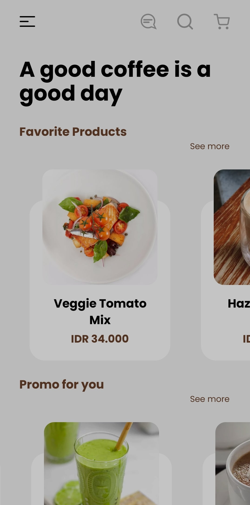
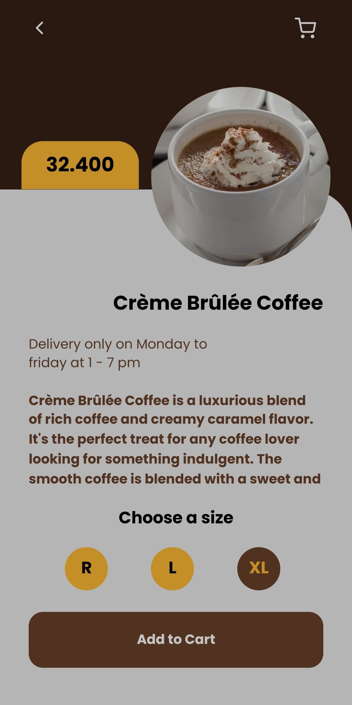
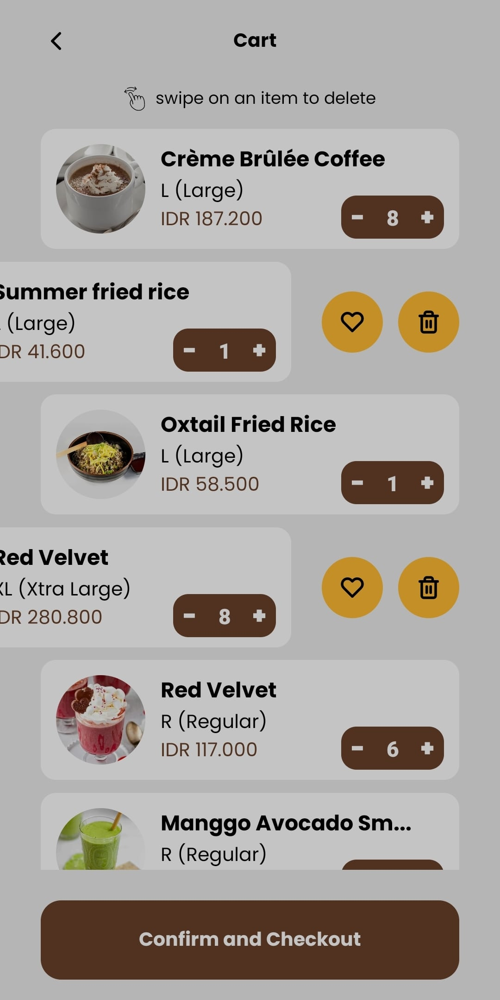
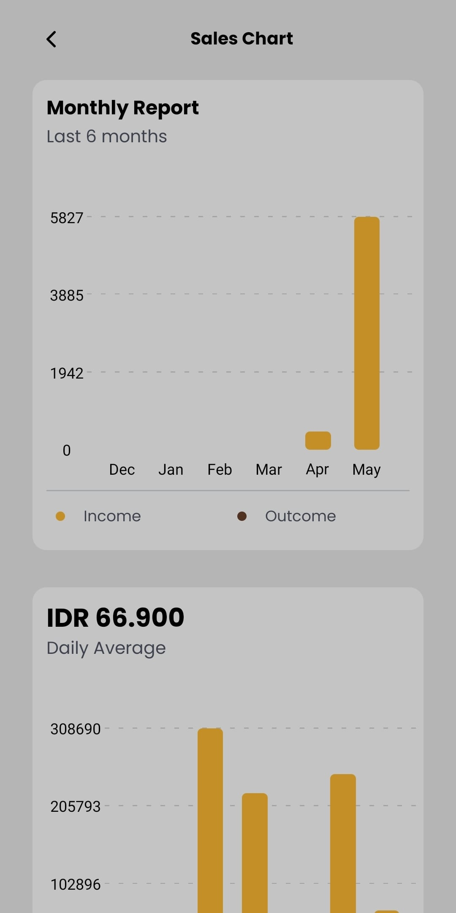
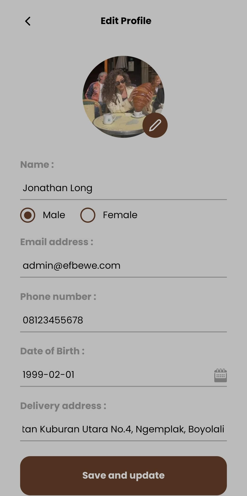

<div align="center">

<h3 align="center"><b>jokopi</b> - Example App</h3>
   <p align="center">
   Open Source. Front-end.
   </p>

[Demo](https://drive.google.com/drive/u/1/folders/1JdLrDwiry5stAuVvtPR7EjnrAaHu6NnK) · [Report Bug](#report-bug) · [Request Feature](#report-bug)

</div>

## Table of Contents

- [Overview](#overview)
  - [Features](#features)
- [Technologies Used](#technologies-used)
- [Getting Started](#getting-started)
  - [Prerequisites](#prerequisites)
  - [Installation](#installation)
- [Screenshots](#screenshots)
- [Related Projects](#related-projects)
- [License](#license)
- [Report Bug](#report-bug)

## Overview

jokopi is a complete open-source app coffee shop ordering.

This is an example application that shows how `jokopi` is applied to a react native app.

You can build it by yourself

### Features

- Login, Register, Forgot Password, Logout
- Profile
- History Order
- Products (Search, Sort, Filter)
- Cart
- Transactions
- Admin Dashboard
- Manage Order (Admin)
- Notification (Remote)

## Technologies Used


- [React Native](https://reactnative.dev/)
- [Redux](https://redux.js.org/) & [Redux Persist](https://www.npmjs.com/package/redux-persist)
- [Async Storage](https://www.npmjs.com/package/@react-native-async-storage/async-storage)
- [Notifee](https://www.npmjs.com/package/@notifee/react-native)
- [React Navigation](https://reactnavigation.org/)
- [Nativewind](https://www.nativewind.dev/) & [TailwindCSS](https://tailwindcss.com/)
- [Nativebase](https://nativebase.io/)
- [Firebase Messaging](https://firebase.google.com/docs/cloud-messaging)
- etc.

## Getting Started

### Prerequisites

You need to install some software to run this project

- [NodeJS](https://nodejs.org/en/download) (LTS version recommended, 14 or newer)
- [Android Studio](https://developer.android.com/studio)
- [Java Development Kit](https://www.oracle.com/java/technologies/javase/jdk11-archive-downloads.html) (version 11 recommended)
- [Watchman](https://facebook.github.io/watchman/docs/install/#buildinstall)
- Android Emulator Device / Real Device
- [See install guide...](https://reactnative.dev/docs/environment-setup?guide=native#installing-dependencies)

### Installation

1. Clone this repository to your local

   ```bash
   git clone https://github.com/nyannss/jokopi-react-native.git
   ```

2. Change current directory

   ```bash
   cd jokopi-react-native
   ```

3. Install dependencies

   If you using npm

   ```bash
   npm install
   ```

   If you using yarn

   ```bash
   yarn
   ```

4. Setup environment

   ```env
   APP_HOST = (your rest api host)
   ```

5. Running app

   1. Start Metro

      ```bash
      npx react-native start
      ```

   2. Start app

      ```bash
      npx react-native run-android
      ```

## Screenshots

<div align="center" style="display:flex;flex-wrap:wrap;gap:1rem">





</div>

Wanna see more? [click here](https://drive.google.com/drive/u/1/folders/12wzzTuKkkOxK_R8IFBLLNh1YBDJxfKdp)

## Related Projects

- [jokopi-express](https://github.com/nyannss/jokopi) - Rest API
- [jokopi-react](https://github.com/nyannss/jokopi-react) - Web Application

## License

This project is licensed under the ISC License. See the [LICENSE](LICENSE) file for details.

## Report Bug

Any error report you can pull request
or contact: <nyannss@proton.me>
